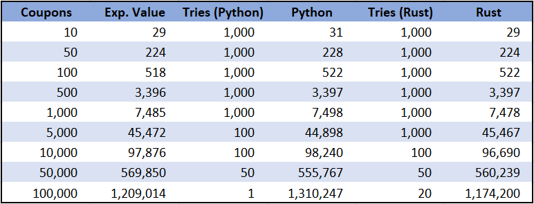
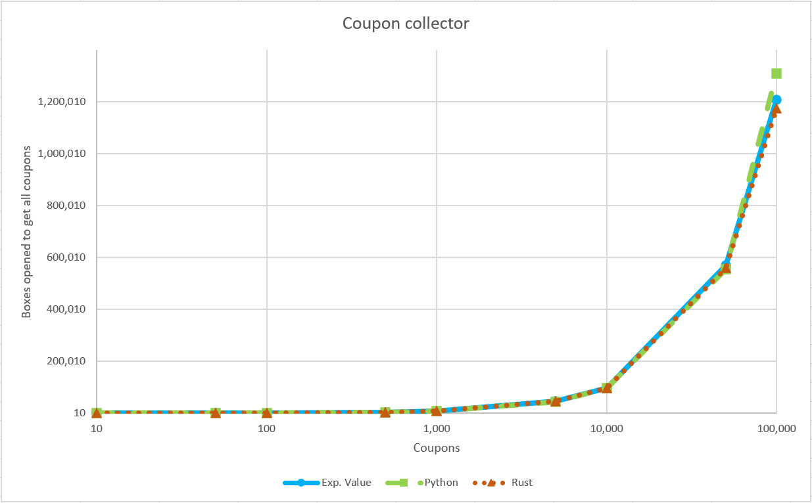
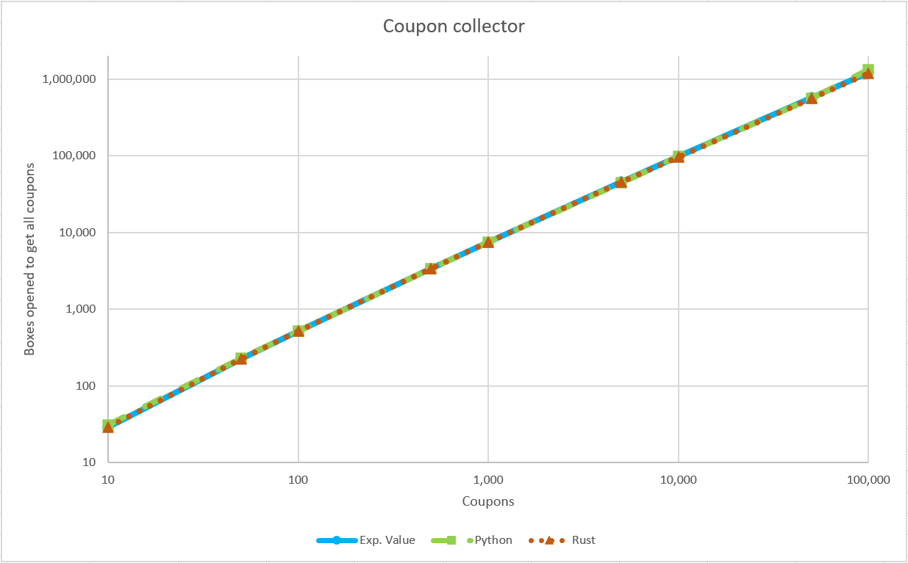

# Colector de cupones

El problema del colector de cupones consiste en juntar al menos un cupon de cada tipo dentro de un conjunto de n distintos cupones. Los cupones están distribuidos en cajas de forma uniforme, es decir, en una caja puede salir cualquier cupón sin importar que ya hayan salido cupones antes.

Es posible calcular la cantidad esperada de cajas que se necesitarán abrir para conseguir los n distintos cupones, y el objetivo de este pequeño programa es comprobar que dicho cálculo del valor esperado es el correcto.

A continuación se muestra una tabla con los resultados de dicho programa.

Se realizó un menor número de simulaciones en Python debido al mayor tiempo de ejecución de dicho lenguaje.

Además, se colocan dos gráficas en las que se puede apreciar de forma más clara que no existe una diferencia significativa entre el valor esperado y el promedio de varios intentos del algoritmo.

Con lo anterior se puede ver que el cálculo del valor esperado es bastante preciso, con lo que no es necesario ejecutar simulaciones del algoritmo.
