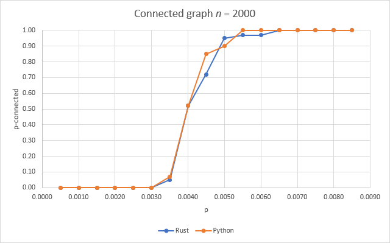
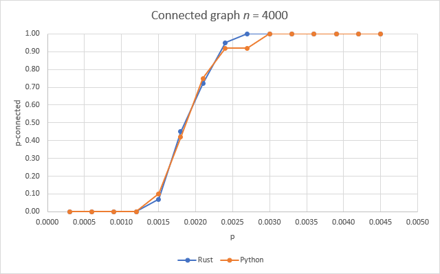

# Grafo conectado

Este problema consiste en comprobar si un grafo bajo el modelo Gn,p es conectado. El modelo Gn,p consiste en tomar un grafo con *n* nodos y crear o no una arista entre cada par de nodos con probabilidad *p*. Después de ello se debe comprobar si el grafo es conectado o no, para lo cual se realiza una búsqueda en profundidad en la que se comprueba si se han visitado todos los nodos del grafo.
  
Para ejecutar el algoritmo en Python, ejecutar 'python graph.py'. Para ejecutar el algoritmo en Rust, entrar a la carpeta 'rust' y ejecutar 'cargo run'.

A continuación se muestran algunos resultados obtenidos.

Se puede observar que mientras más nodos haya en el grafo, se consiguen grafos conexos usando probabilidades *p* menores.
