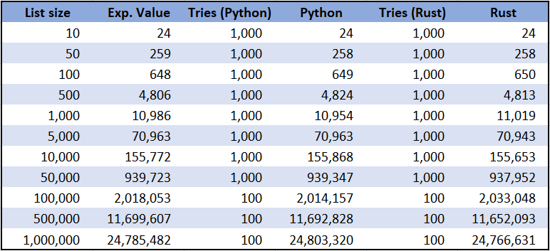
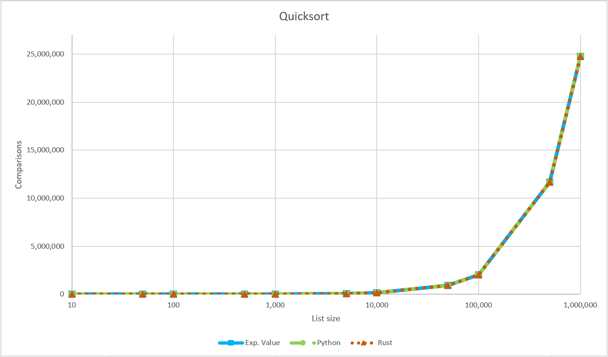
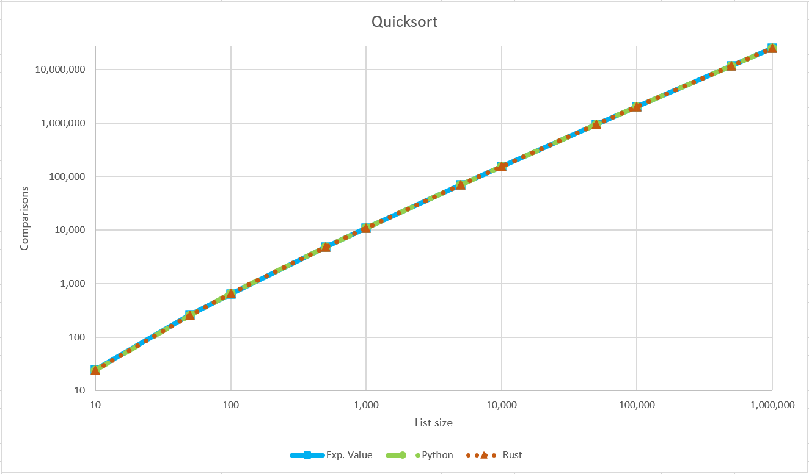

# Tiempo de ejecución de Quicksort

Es posible determinar la cantidad de comparaciones que serán realizadas en una ejecución del algoritmo Quicksort dependiendo de la cantidad de elementos de la lista de entrada. El objetivo de este pequeño programa es comprobar que esa cantidad de comparaciones calculada es precisa, de forma que no sea necesario ejecutar el algoritmo siempre que se quiera saber ese dato.

Para ejecutar el algoritmo en Python, acceder a la carpeta 'python', y ejecutar 'python quicksort.py'. Para ejecutar el algoritmo en Rust, entrar a la carpeta 'rust' y ejecutar 'cargo run'.

A continuación se muestra una tabla con los resultados de dicho programa.

Además, se colocan dos gráficas en las que se puede apreciar de forma más clara que no existe una diferencia significativa entre el valor esperado y el promedio de varios intentos del algoritmo.

Lo anterior muestra que la precisión del valor esperado es suficiente para determinar cuanto tiempo tomará ejecutar el algoritmo Quicksort.
